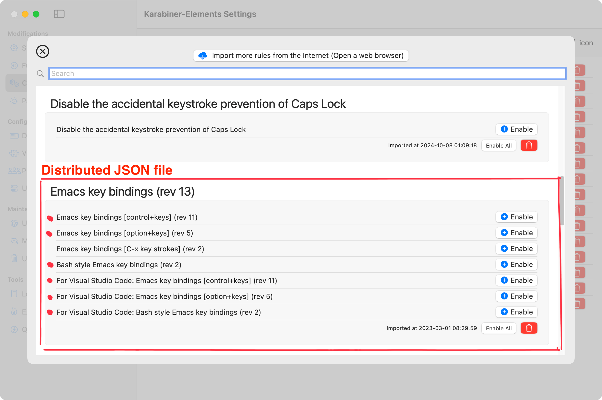
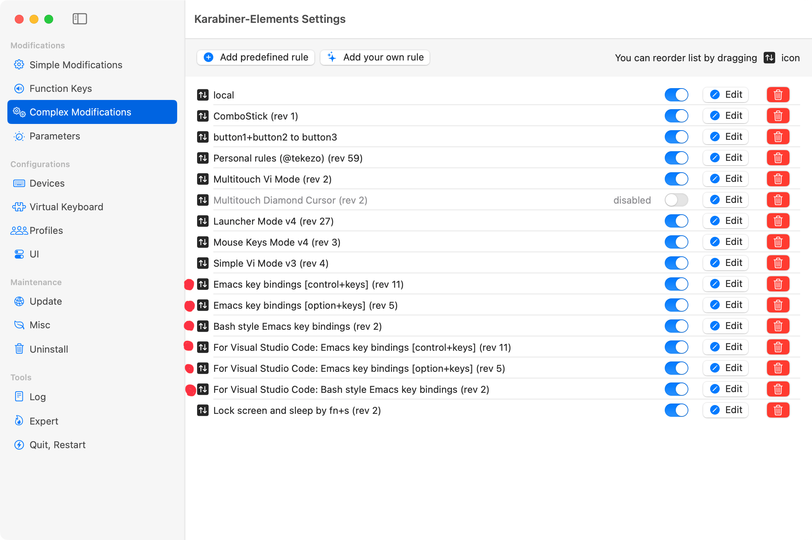
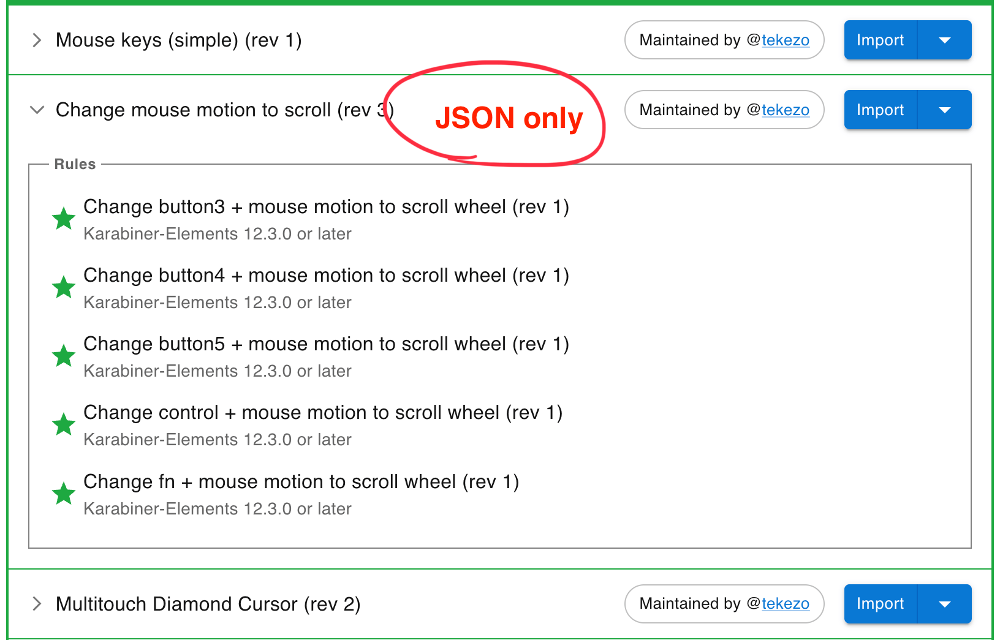
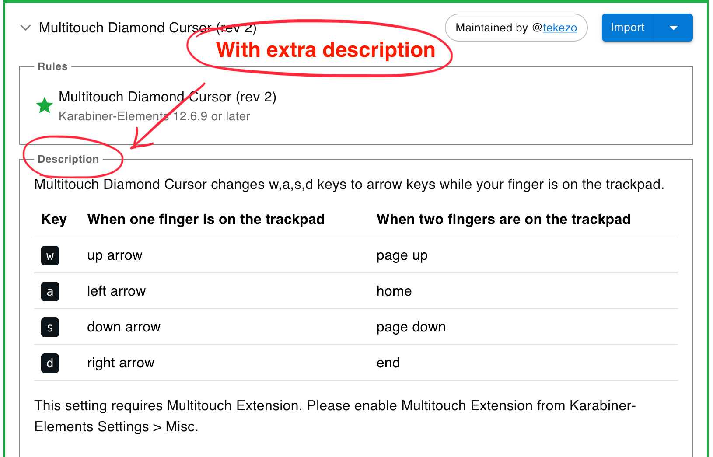

[](https://github.com/pqrs-org/KE-complex_modifications/actions)
[](https://github.com/pqrs-org/KE-complex_modifications/blob/main/LICENSE.md)

# KE-complex_modifications

complex_modifications for Karabiner-Elements.

<https://ke-complex-modifications.pqrs.org/>

## complex_modifications documents

-   [karabiner.json Reference Manual](https://karabiner-elements.pqrs.org/docs/json/)
    -   [Typical complex_modifications examples](https://karabiner-elements.pqrs.org/docs/json/typical-complex-modifications-examples/)
    -   [complex_modifications manipulator definition](https://karabiner-elements.pqrs.org/docs/json/complex-modifications-manipulator-definition/)

## JSON file format in this repository

The JSON files in this repository bundle multiple rules into a single file so users can pick and enable what they need.
For example, the "Emacs key bindings" package includes several rule sets for different use cases.

| The distributed JSON file                                      | Complex Modifications                                          |
| -------------------------------------------------------------- | -------------------------------------------------------------- |
|  |  |

To package them this way, the JSON has the following structure.
Each element under rules is a single rule as defined in Complex Modifications.

If you list GitHub usernames in the "maintainers" field, the distribution site will automatically link to those accounts:
<https://ke-complex-modifications.pqrs.org/>

```json
{
    "title": "Emacs key bindings (rev XXX)",
    "maintainers": ["tekezo"],
    "rules": [
        {
            "description": "Emacs key bindings [control+keys] (rev XXX)",
            "manipulators": [
                {
                    "type": "basic",
                    "from": {},
                    "to": []
                }
            ]
        },
        {
            "description": "Emacs key bindings [option+keys] (rev XXX)",
            "manipulators": [
                {
                    "type": "basic",
                    "from": {},
                    "to": []
                }
            ]
        }
    ]
}
```

## How to add your rules

Follow the steps below to create a PR and add your settings!

1.  Fork this repository on GitHub.
2.  Clone the repository in Terminal.

    ```shell
    git clone --depth 1 https://github.com/{your_account}/KE-complex_modifications.git
    cd KE-complex_modifications
    git submodule update --init --recursive --depth 1
    ```

3.  Create a git branch in Terminal.

    ```shell
    git switch -c my-settings
    ```

4.  Put a JSON generator file (`.js`) into [src/json](https://github.com/pqrs-org/KE-complex_modifications/tree/main/src/json).
    (Or put a `.json` file directly into [public/json](https://github.com/pqrs-org/KE-complex_modifications/tree/main/public/json) directory.)
5.  <details>
    <summary>
        (Optional) Update public/groups.json if you want to add your rules to a particular category.
    </summary>

    Add the following entry into [public/groups.json](public/groups.json).

    ```json5
    {
        "path": "json/your_awesome_configuration.json", // required
        "extra_description_path": "extra_descriptions/your_awesome_configuration.html" // optional
    },
    ```

    You can use the tag `<kbd>⇧Shift</kbd>` to make a nice <kbd>⇧Shift</kbd> in your html.
    </details>

6.  Run `make` command in Terminal to validate your files.<br/>
    If you placed a generator file into `src/json`, json file will be generated in the `public/json` by this command.

    ```shell
    make all
    ```

    If there is a problem, an error message is displayed. Fix your files until no errors are shown.

    ```text
    "../public/json/personal_tekezo.json": `Personal rules (@tekezo) (rev 47)` error: `to` entry error: `key_code` error: unknown key_code: `"space"`
    make[1]: *** [all] Error 1
    make: *** [all] Error 2
    ```

7.  Test your files

    Copy a json file to `~/.config/karabiner/assets/complex_modifications`.

    ```shell
    cp public/json/your_awesome_configuration.json ~/.config/karabiner/assets/complex_modifications
    ```

    Import rules from `Karabiner-Elements Settings > Complex Modifications > Rules > Add rule`.

8.  <details>
    <summary>
        (Optional) Test your files on local web server.
    </summary>

    Run local web server by the following command in Terminal.

    ```shell
    make preview-server
    ```

    Then open <http://localhost:8000>.

9.  Run `git commit` and `git push` in Terminal.

    ```shell
    git add -A
    git commit -m 'your commit message'
    git push --set-upstream origin my-settings
    ```

10. Create a PR on GitHub.

## How to add additional description for your rules

Use the `description` field to explain how each distributed JSON rule works.
If a one-line description is not enough (e.g., for complex rules), you can add supplementary text on the site:

1.  Place an HTML file under `public/extra_descriptions/`.
2.  Reference that HTML file from `public/groups.json`.

The additional description will then appear on the site as shown in the screenshot.

| JSON only                               | With extra description                                |
| --------------------------------------- | ----------------------------------------------------- |
|  |  |

-   Example of extra description:
    -   <https://ke-complex-modifications.pqrs.org/?q=diamond#multitouch_diamond_cursor>
-   Example of HTML file:
    -   <https://github.com/pqrs-org/KE-complex_modifications/blob/main/public/extra_descriptions/multitouch_diamond_cursor.json.html>
-   Example entry in groups.json:

```json
{
    "path": "json/multitouch_diamond_cursor.json",
    "extra_description_path": "extra_descriptions/multitouch_diamond_cursor.json.html"
}
```

### Tips for writing extra description HTML file

-   Bootstrap's CSS are applied automatically, so you can adjust spacing with utility classes like mt-4, etc.
-   Do not include `<html>` and `<body>` tags. Write only the HTML for the description section.
-   You can include images with tags like ``.
    Be sure to add the images to the repository.
-   As described above, you can preview your HTML by `make preview-server` command and open `http://localhost:8000/` in your browser.
    The HTML file will not be loaded unless you specify `extra_description_path` in `public/groups.json`, so be sure to update `groups.json`.
-   After modifying an HTML file, reload the page in your browser to reflect the changes on the preview server.
    Automatic hot reload is not supported.

## Sync your fork

To update your previously forked repositories, run the following command in Terminal.

### Run only once

```shell
git remote add upstream https://github.com/pqrs-org/KE-complex_modifications.git
```

### Run every time

```shell
# switch to main branch
git switch main

# fetch upstream
git fetch --all --prune --prune-tags

# update local repository
git reset --hard upstream/main

# update submodules
git submodule update --init --recursive

# clean files
git clean -x -d -f .

# update GitHub repository
git push
```

## Notes on creating your generators

The code in `src/json/*.js` is executed by [Duktape](https://duktape.org/), which is built into the Karabiner-Elements's command line interface ( `karabiner_cli`).

Unlike the latest Node.js, the basic language specification is ES5.1, so the following features cannot be used.

-   `let` (`const` is specially supported)
-   Arrow functions
-   Default parameters
-   Spread (...) syntax
-   Template literals

### Examples

There are many existing codes. Here are some of the more distinctive ones among them.

-   Use the predefined list of bundle identifiers in `frontmost_application_if`.
    -   [capslock_shift_copy_paste.json.js](https://github.com/pqrs-org/KE-complex_modifications/blob/main/src/json/capslock_shift_copy_paste.json.js)
-   Generate remappings from a list of characters
    -   [colemak_layout.json.js](https://github.com/pqrs-org/KE-complex_modifications/blob/main/src/json/colemak_layout.json.js)
-   Include file from another file
    -   [personal_thooams.json.js](https://github.com/pqrs-org/KE-complex_modifications/blob/main/src/json/personal_thooams.json.js)
    -   [control_backspace_to_function_backspace.json.js](https://github.com/pqrs-org/KE-complex_modifications/blob/main/src/json/control_backspace_to_function_backspace.json.js)
-   Generate rules from key combinations
    -   [matias_ergo_pro.json.js](https://github.com/pqrs-org/KE-complex_modifications/blob/main/src/json/matias_ergo_pro.json.js)
